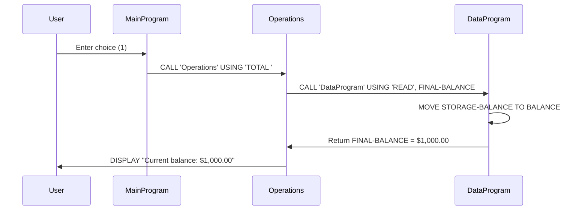
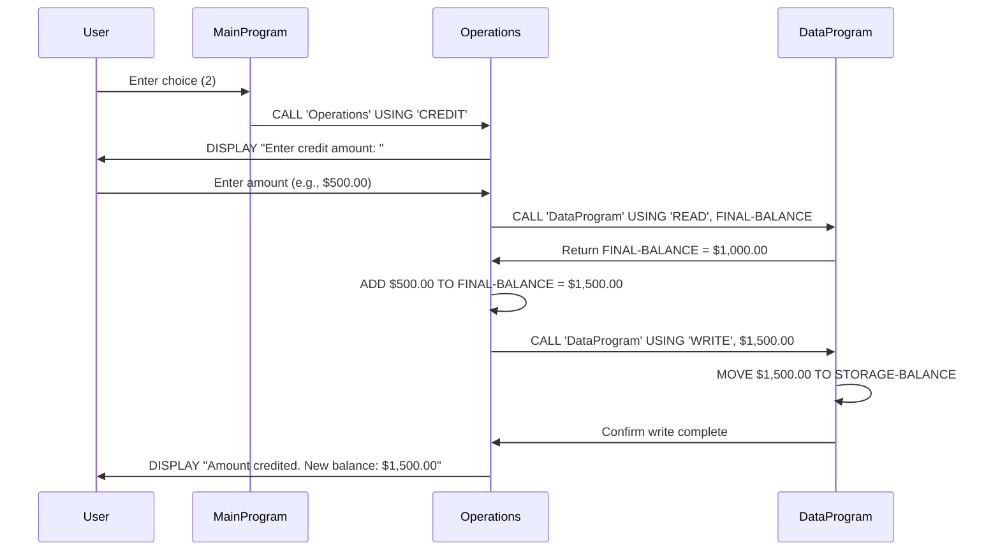
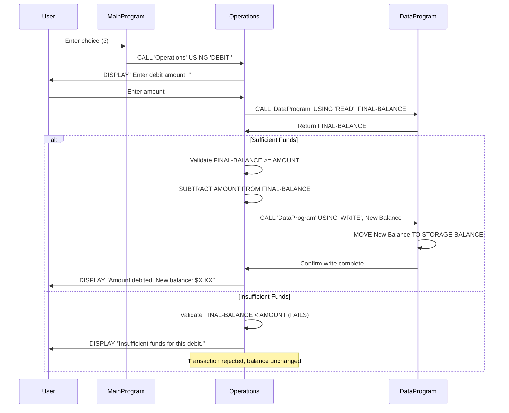
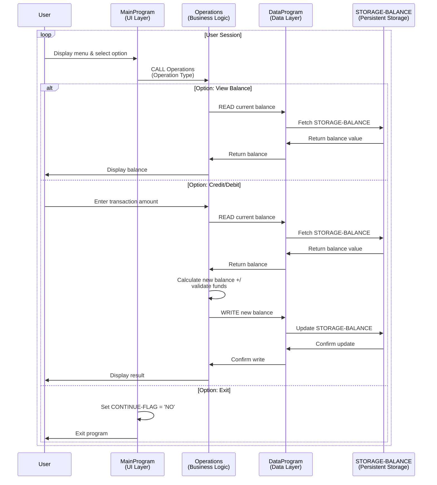

# COBOL Account Management System - Documentation

## Overview
This is a COBOL-based Account Management System designed to handle basic financial operations for student accounts. The system provides a menu-driven interface allowing users to view balances, credit accounts, and debit accounts with built-in validation.

---

## Program Structure

### 1. **MainProgram** (main.cob)
**Purpose:** Entry point and user interface controller for the account management system.

**Key Functions:**
- Displays an interactive menu with four options
- Validates user input (choices 1-4)
- Routes user requests to the appropriate operations subprogram
- Implements a loop-based interface that continues until the user selects "Exit"

**Menu Options:**
- Option 1: View Balance
- Option 2: Credit Account
- Option 3: Debit Account
- Option 4: Exit Program

**Business Logic:**
- Runs in a continuous loop (`PERFORM UNTIL CONTINUE-FLAG = 'NO'`)
- Only exits when user explicitly selects option 4
- Displays an error message for invalid selections

---

### 2. **Operations** (operations.cob)
**Purpose:** Handles the core business operations on student accounts (balance inquiry, credit, debit).

**Key Functions:**
- **TOTAL (View Balance):** Retrieves and displays the current account balance
- **CREDIT (Credit Account):** Accepts a credit amount from the user, retrieves the current balance, adds the credit amount, and updates storage
- **DEBIT (Debit Account):** Accepts a debit amount, retrieves the current balance, validates sufficient funds, and processes the debit if funds are available

**Business Rules:**
- Initial balance: $1,000.00
- Debit operations are only allowed if the account has sufficient funds
- If insufficient funds exist, the transaction is rejected and an appropriate message is displayed
- All monetary values are stored with two decimal places (99 cents precision)

**Data Variables:**
- `OPERATION-TYPE`: Identifies which operation to perform
- `AMOUNT`: The transaction amount entered by the user
- `FINAL-BALANCE`: The current account balance

---

### 3. **DataProgram** (data.cob)
**Purpose:** Persistent data storage layer managing the account balance in working storage.

**Key Functions:**
- **READ Operation:** Retrieves the current balance from storage
- **WRITE Operation:** Updates and persists the account balance in storage

**Storage Details:**
- `STORAGE-BALANCE`: Main storage location for the account balance
- Initial value: $1,000.00
- Format: 9(6)V99 (supports balances up to $999,999.99)

**Design Pattern:**
- Implements a simple data abstraction layer using linkage section parameters
- Receives operations and balance values through the `USING` clause
- Returns updated balance values back to the calling program

---

## Program Flow Diagram

```
MainProgram (Entry Point)
    ↓
Display Menu → Accept User Choice
    ↓
EVALUATE Choice:
    ├─ 1 → Call Operations (TOTAL) → Call DataProgram (READ)
    ├─ 2 → Call Operations (CREDIT) → DataProgram (READ + WRITE)
    ├─ 3 → Call Operations (DEBIT) → DataProgram (READ + WRITE with validation)
    └─ 4 → Exit Program
```

---

## Business Rules for Student Accounts

1. **Initial Balance:** All student accounts start with $1,000.00
2. **Credit Transactions:** Any positive amount can be credited to the account
3. **Debit Transactions:** Only allowed if the account balance is equal to or greater than the debit amount
4. **Insufficient Funds:** Debit requests that exceed available balance are rejected without processing
5. **Precision:** All monetary values maintain two decimal place precision (cents)
6. **Data Persistence:** Balance updates are preserved during program execution through the DataProgram storage layer

---

## Technical Notes

- **Language:** COBOL
- **Architecture:** Three-tier structure (UI → Operations → Data)
- **Data Format:** 
  - Monetary values: PIC 9(6)V99 (6 digits before decimal, 2 after)
  - Operations: 6-character string identifiers
- **Control Flow:** Uses PERFORM UNTIL loops and EVALUATE conditional statements
- **Interprogram Communication:** Programs communicate via CALL statements with USING parameters

---

## Data Flow Sequence Diagrams

### View Balance Operation


### Credit Account Operation


### Debit Account Operation (Success & Failure Cases)


### Complete System Data Flow

